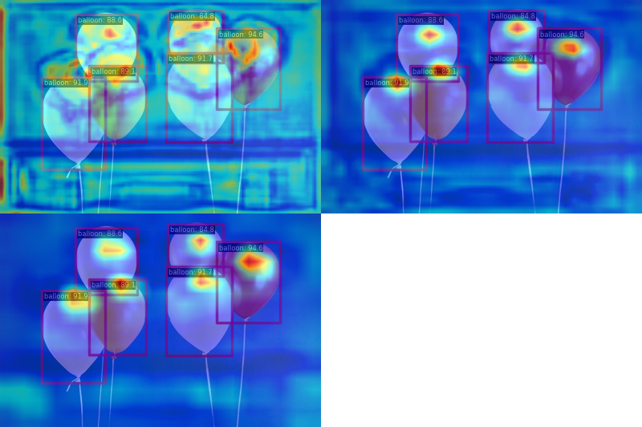

# mmdetection作业

说明：
- train日志：[20230610_214713.log](https://github.com/fuyueagain/MMlab_train/blob/main/03MMDetection/20230610_214713.log)
- test日志：[20230610_215829.log](https://github.com/fuyueagain/MMlab_train/blob/10c3df5060c549ebfec163efd4d48b36baeec74e/03MMDetection/20230610_215829.log)
- jupyternotebook中训练过程：[ballon_rtmdet.ipynb](ballon_rtmdet.ipynb)
- 训练配置文件：[balloon_rtmdet.py](balloon_rtmdet.py)
- 输出图片：[images](images)

## 结果：
1. test结果：

- 输出：

2. 预测结果

3. 可视化结果
- backbone：

- neck：

- min:

- max:

